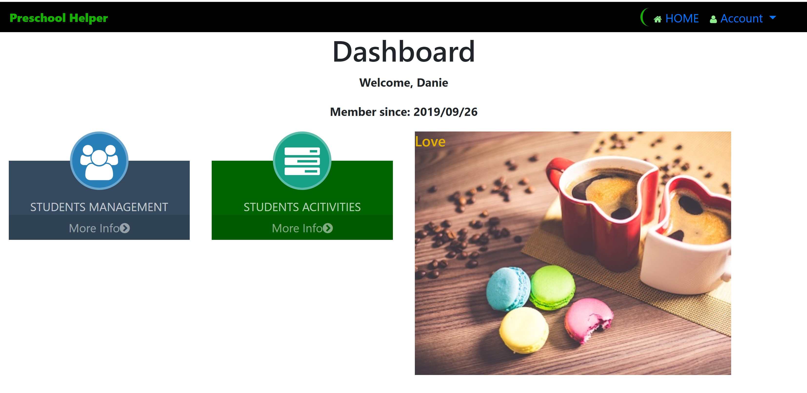
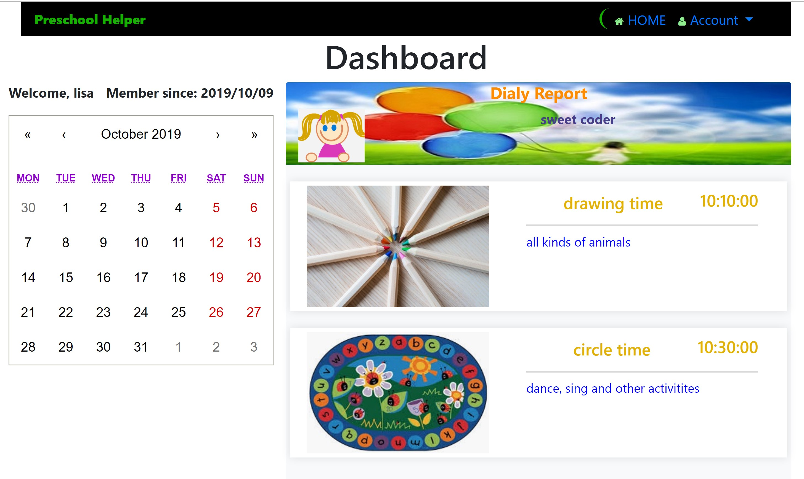
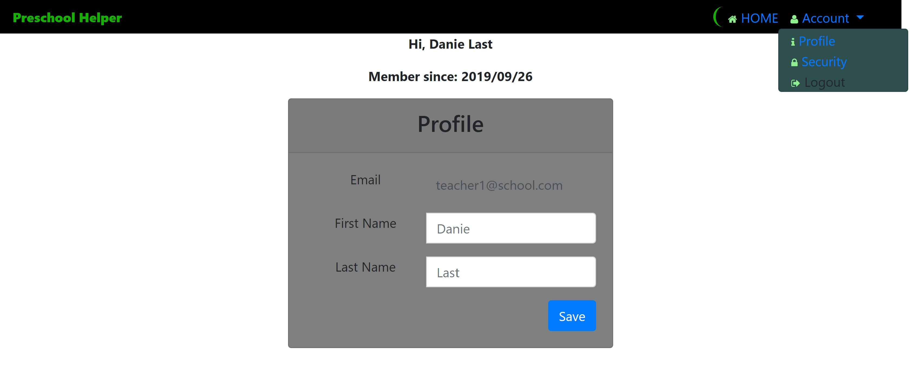

# Preschool Helper

### App Live Link
https://stark-reaches-61224.herokuapp.com/

### App GitHub Link
https://github.com/helenhao888/PreschoolHelper.git

### Developer
    Developed by Helen Hao (helenhao888)
    
### Technologies
    
    React.js 
    JSX
    MVC design 
    javascript/ES6    
    HTML
    CSS   
    Express
    MySQL/sequelize
    JSON
    Path
    Passport JWT
    HeroKu/GitHub

### Screenshots
1. Login page  
   
   
   
2. Teacher Dashboard
    
   

3.  Parent Dashboard   
   
   
   

4.   Profile
   

### Contact Information

   Helen Hao :
   :link:[linkedIn](https://www.linkedin.com/in/jinzhao-helen-hao-611b3752/) 
   :link:[Portfolio](https://helenhao888.github.io)       
